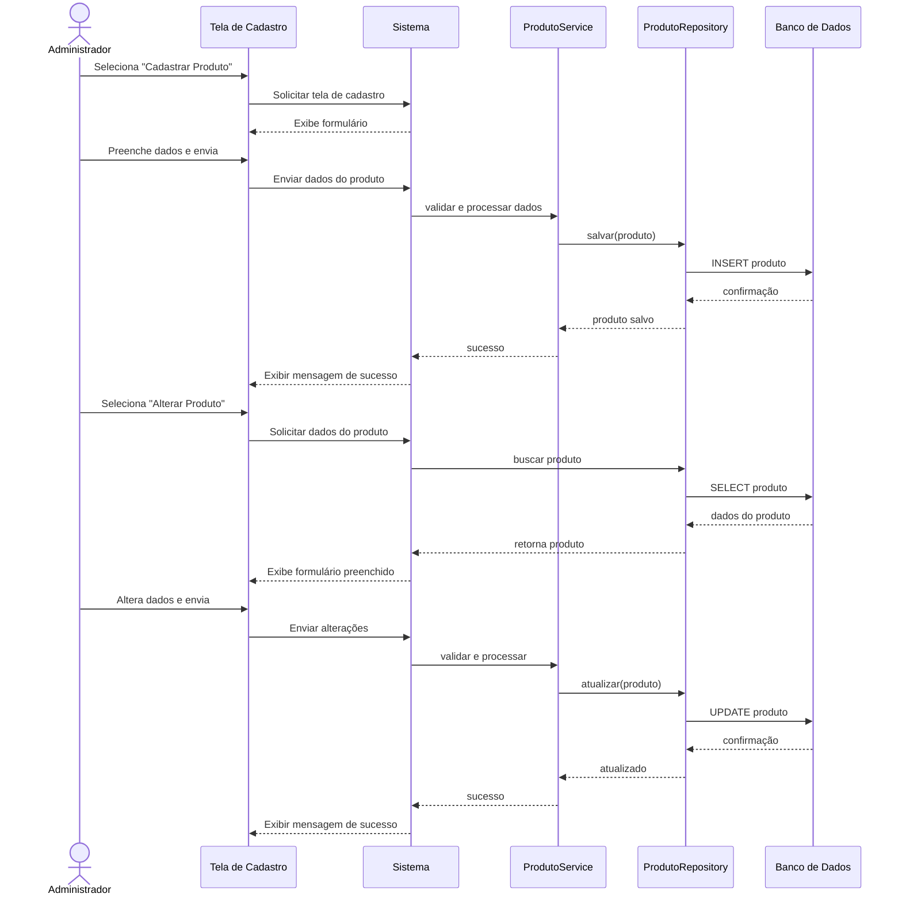

```mermaid

sequenceDiagram

actor Administrador
participant Tela as Tela de Cadastro
participant Sistema
participant Service as ProdutoService
participant Repo as ProdutoRepository
participant BD as Banco de Dados

%% Cadastro de Produto
Administrador ->> Tela: Seleciona "Cadastrar Produto"
Tela ->> Sistema: Solicitar tela de cadastro
Sistema -->> Tela: Exibe formulário

Administrador ->> Tela: Preenche dados e envia
Tela ->> Sistema: Enviar dados do produto
Sistema ->> Service: validar e processar dados
Service ->> Repo: salvar(produto)
Repo ->> BD: INSERT produto
BD -->> Repo: confirmação
Repo -->> Service: produto salvo
Service -->> Sistema: sucesso
Sistema -->> Tela: Exibir mensagem de sucesso

%% Alteração de Produto
Administrador ->> Tela: Seleciona "Alterar Produto"
Tela ->> Sistema: Solicitar dados do produto
Sistema ->> Repo: buscar produto
Repo ->> BD: SELECT produto
BD -->> Repo: dados do produto
Repo -->> Sistema: retorna produto
Sistema -->> Tela: Exibe formulário preenchido

Administrador ->> Tela: Altera dados e envia
Tela ->> Sistema: Enviar alterações
Sistema ->> Service: validar e processar
Service ->> Repo: atualizar(produto)
Repo ->> BD: UPDATE produto
BD -->> Repo: confirmação
Repo -->> Service: atualizado
Service -->> Sistema: sucesso
Sistema -->> Tela: Exibir mensagem de sucesso
```
