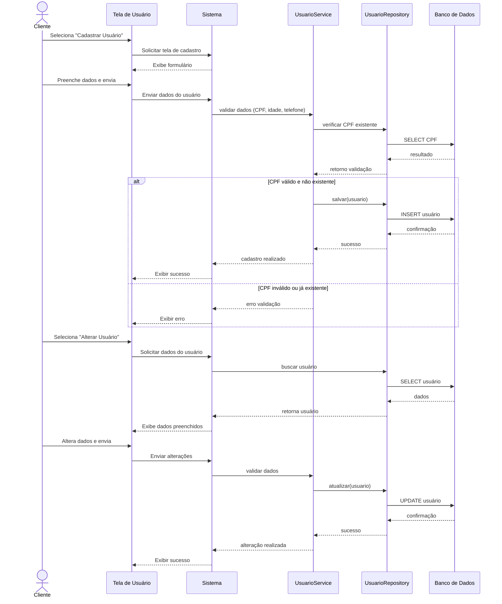

```mermaid
sequenceDiagram

actor Cliente
participant Tela as Tela de Usuário
participant Sistema
participant Service as UsuarioService
participant Repo as UsuarioRepository
participant BD as Banco de Dados

%% Cadastro de Usuário
Cliente ->> Tela: Seleciona "Cadastrar Usuário"
Tela ->> Sistema: Solicitar tela de cadastro
Sistema -->> Tela: Exibe formulário

Cliente ->> Tela: Preenche dados e envia
Tela ->> Sistema: Enviar dados do usuário
Sistema ->> Service: validar dados (CPF, idade, telefone)
Service ->> Repo: verificar CPF existente
Repo ->> BD: SELECT CPF
BD -->> Repo: resultado
Repo -->> Service: retorno validação

alt CPF válido e não existente
    Service ->> Repo: salvar(usuario)
    Repo ->> BD: INSERT usuário
    BD -->> Repo: confirmação
    Repo -->> Service: sucesso
    Service -->> Sistema: cadastro realizado
    Sistema -->> Tela: Exibir sucesso
else CPF inválido ou já existente
    Service -->> Sistema: erro validação
    Sistema -->> Tela: Exibir erro
end

%% Alteração de Usuário
Cliente ->> Tela: Seleciona "Alterar Usuário"
Tela ->> Sistema: Solicitar dados do usuário
Sistema ->> Repo: buscar usuário
Repo ->> BD: SELECT usuário
BD -->> Repo: dados
Repo -->> Sistema: retorna usuário
Sistema -->> Tela: Exibe dados preenchidos

Cliente ->> Tela: Altera dados e envia
Tela ->> Sistema: Enviar alterações
Sistema ->> Service: validar dados
Service ->> Repo: atualizar(usuario)
Repo ->> BD: UPDATE usuário
BD -->> Repo: confirmação
Repo -->> Service: sucesso
Service -->> Sistema: alteração realizada
Sistema -->> Tela: Exibir sucesso
```
