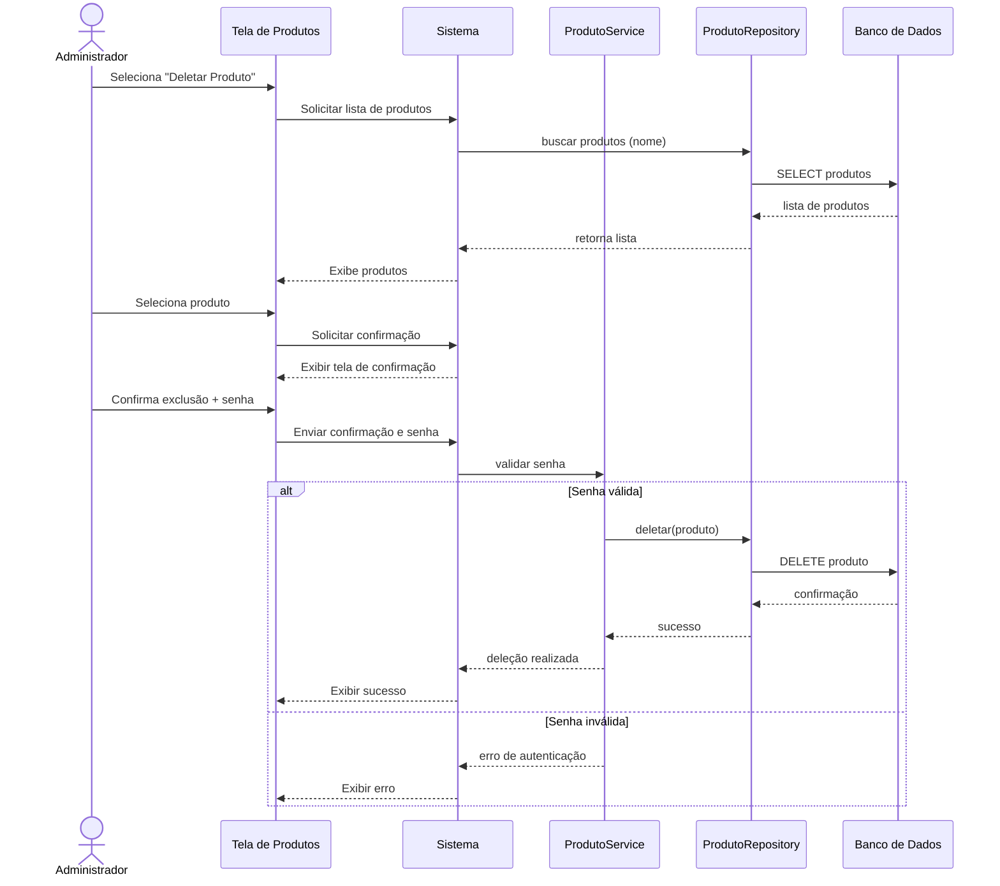

```mermaid
sequenceDiagram

actor Administrador
participant Tela as Tela de Produtos
participant Sistema
participant Service as ProdutoService
participant Repo as ProdutoRepository
participant BD as Banco de Dados

%% Seleção do produto
Administrador ->> Tela: Seleciona "Deletar Produto"
Tela ->> Sistema: Solicitar lista de produtos
Sistema ->> Repo: buscar produtos (nome)
Repo ->> BD: SELECT produtos
BD -->> Repo: lista de produtos
Repo -->> Sistema: retorna lista
Sistema -->> Tela: Exibe produtos

%% Escolha e confirmação
Administrador ->> Tela: Seleciona produto
Tela ->> Sistema: Solicitar confirmação
Sistema -->> Tela: Exibir tela de confirmação

Administrador ->> Tela: Confirma exclusão + senha
Tela ->> Sistema: Enviar confirmação e senha

%% Validação e deleção
Sistema ->> Service: validar senha
alt Senha válida
    Service ->> Repo: deletar(produto)
    Repo ->> BD: DELETE produto
    BD -->> Repo: confirmação
    Repo -->> Service: sucesso
    Service -->> Sistema: deleção realizada
    Sistema -->> Tela: Exibir sucesso
else Senha inválida
    Service -->> Sistema: erro de autenticação
    Sistema -->> Tela: Exibir erro
end
```
