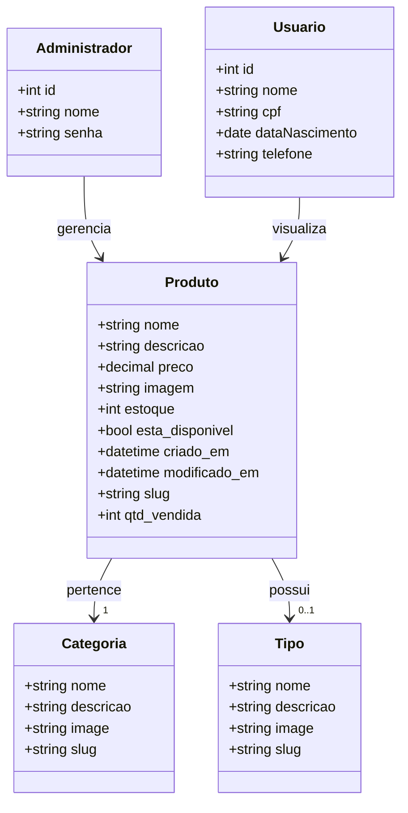

```mermaid
classDiagram

%% =======================
%% Entidades principais
%% =======================

class Produto {
    +string nome
    +string descricao
    +decimal preco
    +string imagem
    +int estoque
    +bool esta_disponivel
    +datetime criado_em
    +datetime modificado_em
    +string slug
    +int qtd_vendida
}

class Categoria {
    +string nome
    +string descricao
    +string image
    +string slug
}

class Tipo {
    +string nome
    +string descricao
    +string image
    +string slug
}

%% =======================
%% Outras classes do sistema
%% =======================

class Administrador {
    +int id
    +string nome
    +string senha
}

class Usuario {
    +int id
    +string nome
    +string cpf
    +date dataNascimento
    +string telefone
}

%% =======================
%% Relacionamentos
%% =======================

Produto --> "1" Categoria : pertence
Produto --> "0..1" Tipo : possui

Administrador --> Produto : gerencia
Usuario --> Produto : visualiza
```
