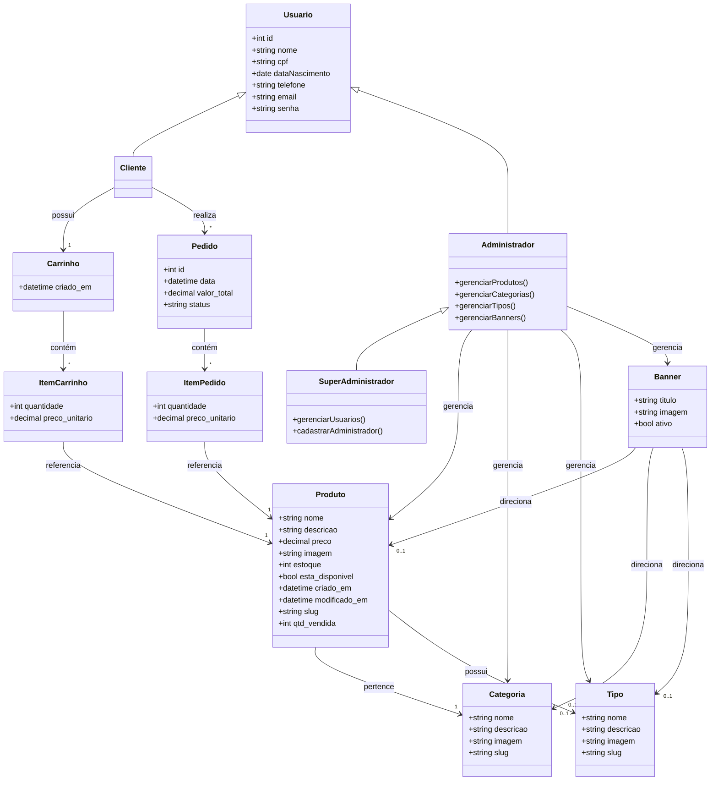

```mermaid
classDiagram

%% =======================
%% Usuários
%% =======================

class Usuario {
    +int id
    +string nome
    +string cpf
    +date dataNascimento
    +string telefone
    +string email
    +string senha
}

class Cliente

class Administrador {
    +gerenciarProdutos()
    +gerenciarCategorias()
    +gerenciarTipos()
    +gerenciarBanners()
}

class SuperAdministrador {
    +gerenciarUsuarios()
    +cadastrarAdministrador()
}

Usuario <|-- Cliente
Usuario <|-- Administrador
Administrador <|-- SuperAdministrador

%% =======================
%% Catálogo
%% =======================

class Produto {
    +string nome
    +string descricao
    +decimal preco
    +string imagem
    +int estoque
    +bool esta_disponivel
    +datetime criado_em
    +datetime modificado_em
    +string slug
    +int qtd_vendida
}

class Categoria {
    +string nome
    +string descricao
    +string imagem
    +string slug
}

class Tipo {
    +string nome
    +string descricao
    +string imagem
    +string slug
}

Produto --> "1" Categoria : pertence
Produto --> "0..1" Tipo : possui

%% =======================
%% Banner
%% =======================

class Banner {
    +string titulo
    +string imagem
    +bool ativo
}

Banner --> "0..1" Produto : direciona
Banner --> "0..1" Categoria : direciona
Banner --> "0..1" Tipo : direciona

%% =======================
%% Carrinho
%% =======================

class Carrinho {
    +datetime criado_em
}

class ItemCarrinho {
    +int quantidade
    +decimal preco_unitario
}

Cliente --> "1" Carrinho : possui
Carrinho --> "*" ItemCarrinho : contém
ItemCarrinho --> "1" Produto : referencia

%% =======================
%% Pedidos
%% =======================

class Pedido {
    +int id
    +datetime data
    +decimal valor_total
    +string status
}

class ItemPedido {
    +int quantidade
    +decimal preco_unitario
}

Cliente --> "*" Pedido : realiza
Pedido --> "*" ItemPedido : contém
ItemPedido --> "1" Produto : referencia

%% =======================
%% Administração
%% =======================

Administrador --> Produto : gerencia
Administrador --> Categoria : gerencia
Administrador --> Tipo : gerencia
Administrador --> Banner : gerencia
```

SuperAdministrador --> Usuario : gerencia
SuperAdministrador --> Administrador : cadastra
